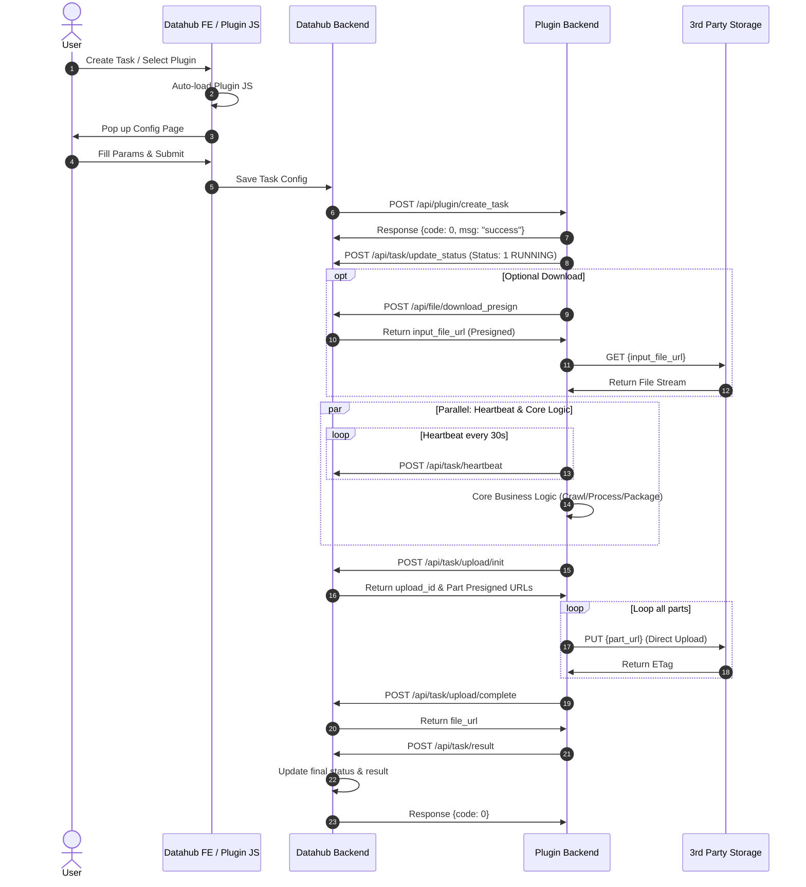
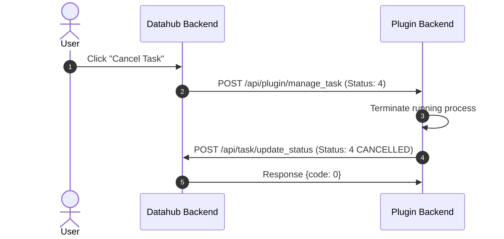
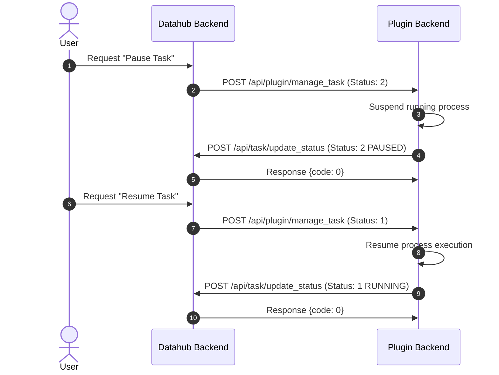

# System Architecture & Workflow

## Task Status Definitions
The lifecycle of a task is tracked using the following status codes:

| Status | Description |
| :--- | :--- |
| **0** | **Initial:** Task created but not started. |
| **1** | **Running:** Task is in progress. |
| **2** | **Paused:** Task is paused, waiting to resume. |
| **3** | **Completed:** Task successfully finished. |
| **4** | **Cancelled:** Task has been cancelled. |
| **5** | **Failed:** Task execution failed. |

## 1. Normal Execution Flow
The following sequence describes the standard lifecycle of a task, from creation to result upload.

## 2. Cancellation Flow
When a user cancels a task, Datahub notifies the plugin to terminate the process. 

    
## 3. Pause & Resume Flow
Datahub can request a plugin to suspend and resume operations.

